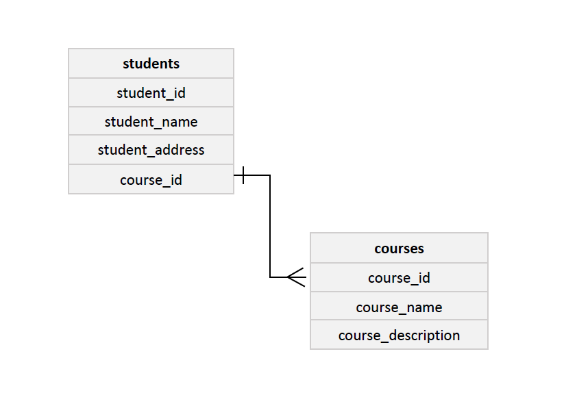

# Intro to Databases with PostgreSQL

## Presentation
* Core topics includes
    * Database concepts
    * Primary DBMS languages
    * Relational modelling
    * Database design views
    * SQL(Create, Select, Insert, Aggregation & grouping, Joins)

* Slides available [here](https://docs.google.com/presentation/d/1CuvzXJ5ebdV-zoUfpcPn4WNDjiJBp4CEcWFD5lAeUiw/edit?usp=sharing).

## Labs - 02
* In case you've not setup a local Postgres yet, follow a quick step-by-step guide [here](https://www.postgresqltutorial.com/install-postgresql/). 
* You might need to add paths, ``.../bin`` and ``.../lib``, to the windows system environment variables.
* In short, for linux;
    ```aidl
    sudo apt-get install postgresql
    ``` 
* With DDL, CREATE, a table called *students* with the attributes:
    * student_id
    * first_name
    * last_name
    * email
    * score
    
    ```roomsql
      CREATE TABLE students (
          student_id smallint NOT NULL,
          student_first_name character varying(20) NOT NULL,
          student_last_name character varying(20) NOT NULL,
          student_email character varying(20) NOT NULL,
          student_score real NOT NULL
      );
    ```
  
* With DML, INSERT, insert 5 records into the relation. Sample: 
    ```roomsql
     INSERT INTO students VALUES(1, 'pk', 'erbynn', 'john.erbynn@turntabl.io', 82.5);
    ```
* Fetch all records with SELECT query.
    ```roomsql
      SELECT * FROM students;
    ```
* Show only the first names and emails of all students.
* Show only the first names and emails of all students order by name.
* Show only the last names and emails of the first three students.
* Show a student with a particular first name using the WHERE clause.
* Display the student with the high score.
* What is the total score of all the students?
* Stretch 
    * Below an illustration of entity relation join
    
    <p align="center">
    
    </p>
    
    * Create another possible table(say courses) and make a reference to it from the student table using a foreign key.
    * Query a full detail of student in relation to the new table(courses) using INNER JOIN.
    
#####NB: 
* ddd
*
<br>
Please, kindly don't hesitate to hit me up for any question, concern, or clarification on the slides or on the deliverables. 

<br>
Thanks. 

Cheers.